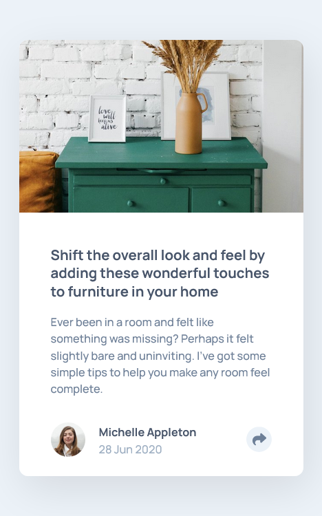
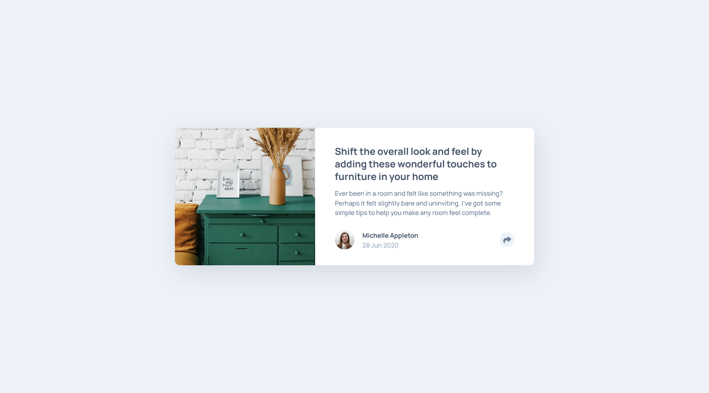

# Frontend Mentor - Article preview component solution

This is a solution to the [Article preview component challenge on Frontend Mentor](https://www.frontendmentor.io/challenges/article-preview-component-dYBN_pYFT). Frontend Mentor challenges help you improve your coding skills by building realistic projects. 

## Table of contents

- [Overview](#overview)
  - [The challenge](#the-challenge)
  - [Screenshot](#screenshot)
  - [Links](#links)
- [My process](#my-process)
  - [Built with](#built-with)
  - [Useful resources](#useful-resources)
- [Author](#author)

## Overview

### The challenge

Users should be able to:

- View the optimal layout for the component depending on their device's screen size
- See the social media share links when they click the share icon

### Screenshot

### Links

- Solution URL: [https://github.com/coderwww/Mentor-Article-preview-component](https://github.com/coderwww/Mentor-Article-preview-component)
- Live Site URL: [https://coderwww.github.io/Mentor-Article-preview-component](https://coderwww.github.io/Mentor-Article-preview-component)

## My process

### Built with

- Semantic HTML5 markup
- SASS(scss)
- Flexbox
- Mobile-first workflow
- Vanilla JS

### Useful resources

- [CSS Tips & Tricks #3 - CSS-only Tooltip](https://www.youtube.com/watch?v=M4lQwiUvGlY) - This helped me to create tooltip. I really liked this pattern and will use it going forward.
- [drop-shadow()](https://developer.mozilla.org/en-US/docs/Web/CSS/filter-function/drop-shadow) - This helped me to create tooltip shadow. I'd recommend it to anyone still learning this concept.

## Author

- Website - [https://coderwww.github.io/](https://coderwww.github.io/)
- Frontend Mentor - [@coderwww](https://www.frontendmentor.io/profile/coderwww)
